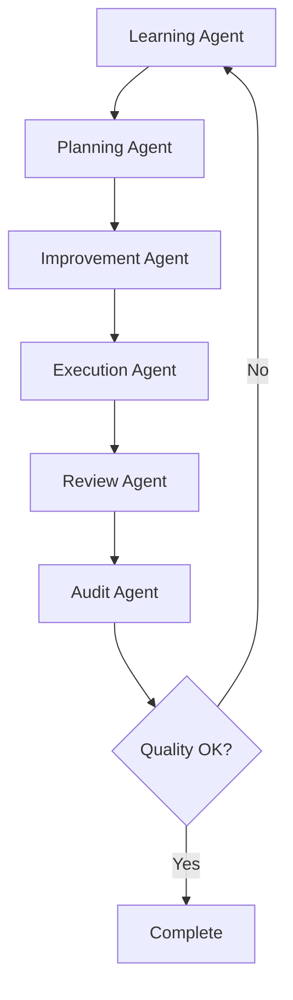

# Agentic Deep Research System for Grant Eval v3

A comprehensive **self-improving agentic research system** that uses multiple specialized AI agents working in coordination to analyze grant evaluation systems, extract insights, and continuously improve performance through automated learning and optimization.

## 🚀 System Overview

This system represents a major evolution from the original research executor to a full **multi-agent architecture** with self-improvement capabilities. The system learns from each execution, optimizes strategies, and iteratively improves results through coordinated agent collaboration.

### 🌟 Key Innovations

- **🤖 Multi-Agent Coordination**: 6 specialized agents working together
- **🔄 Self-Improvement Loop**: Automatically learns and optimizes from each run
- **📊 Comprehensive Monitoring**: Real-time metrics, alerts, and audit trails
- **⚖️ Quality Assessment**: Automated quality evaluation with iteration decisions
- **🎯 Adaptive Execution**: Dynamic strategy adaptation based on runtime conditions
- **🛡️ Compliance & Audit**: Full governance and compliance tracking
- **🔧 Configurable Optimization**: Multiple optimization targets (accuracy, speed, cost, reliability)

## 🏗️ Agent Architecture

### Core Agents

| Agent | Purpose | Key Features |
|-------|---------|-------------|
| **🧠 Learning Agent** | Analyzes past performance and extracts patterns | Pattern recognition, performance insights, success/failure analysis |
| **📋 Planning Agent** | Creates optimized execution strategies | Multiple strategy types, resource allocation, contingency planning |
| **⚡ Improvement Agent** | Implements optimizations before execution | Prompt optimization, A/B testing, rollback capabilities |
| **🎯 Execution Agent** | Runs research with full monitoring | Checkpointing, auto-recovery, real-time monitoring |
| **🛡️ Audit Agent** | Tracks everything for compliance and learning | Compliance checks, security monitoring, audit reports |
| **🔍 Review Agent** | Evaluates results and decides on iterations | Quality assessment, iteration decisions, improvement recommendations |

### 🔄 Self-Improvement Workflow



## 🚀 Quick Start

### Prerequisites

```bash
# Install required packages
pip install openai pyyaml psutil numpy

# Set environment variables
export OPENAI_API_KEY=your_api_key_here
export AGENTIC_RESEARCH_DEBUG=true  # Optional: Enable debug mode
```

### Initial Setup & Testing

```bash
# Navigate to the system directory
cd grant_eval_v3_research

# Run comprehensive system test
python test_agentic_system.py --comprehensive

# Create sample request file
python test_agentic_system.py --create-sample

# Show usage instructions
python test_agentic_system.py --instructions
```

### Basic Usage

```bash
# Run with default settings
python agentic_orchestrator.py

# Run with custom research request
python agentic_orchestrator.py --request sample_research_request.json

# Check system health
python agentic_orchestrator.py --health-check

# View system status
python agentic_orchestrator.py --status

# Use custom configuration
python agentic_orchestrator.py --config path/to/config.yaml
```

## 📁 Directory Structure

```
grant_eval_v3_research/
├── README.md                      # This comprehensive guide
├── agentic_orchestrator.py        # Main orchestration system
├── test_agentic_system.py         # Comprehensive test suite
├── sample_research_request.json   # Sample research request
├── config/                        # Configuration system
│   ├── config.yaml               # Main configuration file
│   ├── config_manager.py         # Configuration management
│   └── research_prompt.md        # Research prompt templates
├── agents/                        # Agent implementations
│   ├── __init__.py               # Agent package initialization
│   ├── base_agent.py             # Base agent functionality
│   ├── learning_agent.py         # Pattern analysis and learning
│   ├── planning_agent.py         # Strategy planning and optimization
│   ├── improvement_agent.py      # Pre-execution optimization
│   ├── execution_agent.py        # Research execution with monitoring
│   ├── audit_agent.py            # Compliance and audit tracking
│   └── review_agent.py           # Quality assessment and iteration
├── scripts/                       # Supporting scripts
│   ├── research_executor.py      # Enhanced research executor
│   └── monitoring_audit_system.py # Monitoring and metrics
├── logs/                          # System logs
│   ├── orchestrator.log          # Main orchestration logs
│   ├── agentic_research.log       # System-wide logging
│   └── research_session_*.log    # Session-specific logs
└── results/                       # Research results by session
    └── {session_id}/              # Session-specific results
        ├── final_results.json     # Complete workflow results
        ├── workflow_summary.json  # Concise summary
        ├── session.log           # Execution log
        └── api_responses.jsonl   # API interaction logs
```

## 🎯 Research Request Format

Create a JSON file with your research requirements:

```json
{
  "type": "grant_evaluation_analysis",
  "scope": "comprehensive", 
  "focus_areas": [
    "implementation_gaps",
    "performance_issues",
    "architectural_patterns",
    "optimization_opportunities"
  ],
  "analysis_depth": "comprehensive",
  "output_format": {
    "structured": true,
    "include_code_examples": true,
    "include_recommendations": true,
    "confidence_scores": true
  },
  "constraints": {
    "max_duration": 3600,
    "max_cost": 25.0,
    "quality_threshold": 0.8
  },
  "metadata": {
    "description": "Comprehensive grant evaluation system analysis"
  }
}
```

## ⚙️ Configuration

The system is highly configurable via `config/config.yaml`:

### Key Configuration Sections

- **System Settings**: Concurrency, self-improvement, performance tracking
- **Agent Configurations**: Individual agent parameters and thresholds
- **Self-Improvement**: Learning rates, optimization strategies, iteration limits
- **Monitoring**: Alert thresholds, dashboard settings, retention policies
- **Research Parameters**: Analysis depth, focus areas, output formats
- **Quality Standards**: Review criteria, quality metrics, iteration thresholds

### Example Configuration Snippets

```yaml
# System configuration
system:
  self_improvement_enabled: true
  max_concurrent_agents: 3
  performance_tracking: true

# Agent configuration example
agents:
  learning_agent:
    enabled: true
    learning_rate: 0.1
    pattern_threshold: 0.7
    memory_window: 100

# Self-improvement configuration
self_improvement:
  cycle_frequency: "after_each_run"
  improvement_strategies:
    - name: "prompt_optimization"
      enabled: true
      target_metrics: ["accuracy", "completeness"]
```

## 📊 Workflow Phases

The agentic system executes research through these coordinated phases:

1. **🧠 Learning Phase**: Analyze past performance, extract patterns, identify optimization opportunities
2. **📋 Planning Phase**: Create optimized execution strategy with contingency plans
3. **⚡ Improvement Phase**: Implement optimizations (prompts, parameters, strategies)
4. **🎯 Execution Phase**: Run research with comprehensive monitoring and checkpointing
5. **🔍 Review Phase**: Evaluate results against quality metrics and standards
6. **🛡️ Audit Phase**: Ensure compliance, security, and generate audit reports
7. **🔄 Iteration Decision**: Determine if iteration is needed or research is complete

### Self-Improvement Loop

When quality thresholds aren't met, the system automatically:
- Increments iteration counter
- Applies learned improvements from previous cycles
- Re-executes with optimized strategy and parameters
- Continues until quality targets are reached or max iterations exceeded

## 📈 Monitoring & Metrics

### Real-time Monitoring

- **System Health Dashboard**: Overall system status and health indicators
- **Agent Performance**: Individual agent metrics and success rates
- **Quality Metrics**: Completeness, accuracy, relevance, insight depth
- **Resource Usage**: CPU, memory, disk, network, API usage
- **Cost Tracking**: Token usage, API costs, budget monitoring

### Key Metrics Tracked

- **Performance**: Execution time, success rates, throughput
- **Quality**: Accuracy scores, completeness, relevance, confidence
- **Efficiency**: Token usage per insight, cost per research session
- **Reliability**: Error rates, recovery success, system uptime

### Alerting

Configurable alerts for:
- High error rates or system failures
- Excessive resource usage or costs
- Quality degradation or compliance violations
- Performance bottlenecks or timeouts

## 🧠 Agent Memory & Learning

Each agent maintains persistent memory across sessions:

- **📚 Episodic Memory**: Specific research session details and outcomes
- **🧩 Semantic Memory**: Learned patterns, insights, and best practices
- **⚙️ Procedural Memory**: Successful strategies and optimization approaches
- **📊 Performance History**: Success rates, timing, and improvement metrics

### Learning Capabilities

- **Pattern Recognition**: Identify successful strategies and failure modes
- **Strategy Optimization**: Continuously improve execution approaches
- **Parameter Tuning**: Auto-adjust thresholds and configuration values
- **Quality Improvement**: Learn what constitutes high-quality research output

## 🛡️ Security & Compliance

### Security Features

- **API Key Security**: Secure credential handling and rotation support
- **Data Privacy**: Configurable data retention and privacy policies
- **Access Controls**: File permission monitoring and security context tracking
- **Audit Trails**: Complete logs for security and compliance review

### Compliance Capabilities

- **Automated Compliance Checks**: Data privacy, API usage, cost limits, resource usage
- **Audit Reports**: Detailed compliance status with violation tracking
- **Governance**: Configurable policies and automated enforcement
- **Risk Assessment**: Security risk analysis and threat detection

## 🔧 Advanced Features

### Strategy Types

The planning agent supports multiple execution strategies:

- **Sequential**: Step-by-step execution with dependencies
- **Parallel**: Concurrent execution where possible
- **Adaptive**: Runtime strategy adaptation based on conditions
- **Hierarchical**: Multi-level planning and execution
- **Probabilistic**: Uncertainty-aware execution with risk management

### Optimization Targets

Configure optimization for:
- **Accuracy**: Maximize result accuracy and reliability
- **Speed**: Minimize execution time and latency
- **Cost**: Optimize resource usage and API costs
- **Reliability**: Maximize success rates and minimize failures
- **Completeness**: Ensure comprehensive analysis coverage

### Recovery & Resilience

- **Automatic Checkpointing**: Save progress at configurable intervals
- **Auto-recovery**: Resume from failures and network interruptions
- **Rollback Capabilities**: Revert optimizations that degrade performance
- **Graceful Degradation**: Continue operation with reduced functionality

## 🧪 Testing & Validation

### Test Suite

Run the comprehensive test suite to validate system functionality:

```bash
# Complete system validation
python test_agentic_system.py --comprehensive

# Quick smoke test
python test_agentic_system.py --quick

# Create sample files for testing
python test_agentic_system.py --create-sample
```

### Test Categories

- **Configuration System**: YAML parsing, validation, environment overrides
- **Individual Agents**: Initialization, health checks, basic functionality
- **Monitoring System**: Metrics collection, alerting, dashboard functionality
- **Orchestrator**: Coordination logic, phase transitions, error handling
- **End-to-End Workflow**: Complete research workflow execution

## 🔍 Troubleshooting

### Common Issues & Solutions

#### Agent Initialization Failures
```bash
# Check configuration syntax
python -c "import yaml; yaml.safe_load(open('config/config.yaml'))"

# Verify directory structure
python test_agentic_system.py --quick

# Review agent-specific requirements
python agentic_orchestrator.py --health-check
```

#### API Connection Issues
```bash
# Verify API key
echo $OPENAI_API_KEY

# Test API connectivity
python -c "from openai import OpenAI; print(OpenAI().models.list())"

# Check API usage and limits
python agentic_orchestrator.py --status
```

#### Performance Issues
```bash
# Enable debug logging
export AGENTIC_RESEARCH_DEBUG=true

# Review resource usage
python agentic_orchestrator.py --health-check

# Adjust configuration thresholds
# Edit config/config.yaml monitoring and performance sections
```

### Debugging Tools

- **Health Check**: `python agentic_orchestrator.py --health-check`
- **Status Monitor**: `python agentic_orchestrator.py --status`
- **Test Suite**: `python test_agentic_system.py --comprehensive`
- **Log Analysis**: Check `logs/` directory for detailed execution logs
- **Agent Memory**: Review `agents/*/memory/` for agent-specific state

## 🚀 Getting Started Examples

### Example 1: Basic Research Execution

```bash
# Set up environment
export OPENAI_API_KEY=your_key_here

# Run system test
python test_agentic_system.py --quick

# Execute research with defaults
python agentic_orchestrator.py
```

### Example 2: Custom Research with Quality Focus

```json
// high_quality_request.json
{
  "type": "grant_evaluation_analysis",
  "scope": "comprehensive",
  "focus_areas": ["implementation_gaps", "performance_issues"],
  "constraints": {
    "quality_threshold": 0.9,
    "max_iterations": 5
  }
}
```

```bash
# Run high-quality research
python agentic_orchestrator.py --request high_quality_request.json
```

### Example 3: Fast Research with Cost Optimization

```json
// fast_research_request.json
{
  "type": "grant_evaluation_analysis", 
  "scope": "standard",
  "constraints": {
    "max_duration": 1800,
    "max_cost": 10.0,
    "quality_threshold": 0.7
  }
}
```

```bash
# Run cost-optimized research
python agentic_orchestrator.py --request fast_research_request.json
```

## 📚 API Reference

### Key Classes

- `AgenticOrchestrator`: Main coordination and workflow management
- `ConfigManager`: Configuration loading, validation, and management
- `BaseAgent`: Common agent functionality and lifecycle management
- `ResearchMonitoringSystem`: Real-time monitoring and metrics collection

### Key Methods

- `run_research_workflow(request)`: Execute complete agentic research workflow
- `health_check()`: Comprehensive system health assessment
- `get_orchestrator_status()`: Current orchestration status and metrics
- `agent.execute(data)`: Execute individual agent with input data
- `monitoring.track_*(...)`: Track various system metrics and events

## 🔄 Migration from Original System

The new agentic system is **fully backward compatible** with the original research executor while providing significant enhancements:

### Original System Features (Preserved)
- ✅ Comprehensive logging and API response tracking
- ✅ Self-healing architecture with fallback mechanisms  
- ✅ Session isolation and audit trails
- ✅ Vector store creation and file management
- ✅ Progress monitoring and error recovery

### New Agentic Enhancements
- 🆕 Multi-agent coordination with specialized roles
- 🆕 Self-improvement loop with automated optimization
- 🆕 Quality assessment with iteration decisions
- 🆕 Comprehensive monitoring and alerting
- 🆕 Compliance and audit capabilities
- 🆕 Configurable optimization targets and strategies

### Migration Steps

1. **Current users can continue using**: `python scripts/research_executor.py`
2. **Upgrade to agentic system**: `python agentic_orchestrator.py`
3. **Gradual adoption**: Start with basic usage, then enable advanced features
4. **Configuration migration**: Existing configs work; new features require config updates

## 🌟 Benefits & Value Proposition

### For Researchers
- **🎯 Higher Quality Results**: Automated quality assessment and iteration
- **⏱️ Time Savings**: Autonomous operation with minimal intervention
- **📈 Continuous Improvement**: System gets better with each use
- **🔍 Deep Insights**: Multi-agent analysis provides comprehensive perspectives

### For Organizations
- **💰 Cost Optimization**: Automated resource and cost management
- **🛡️ Compliance**: Built-in audit trails and governance features
- **📊 Visibility**: Comprehensive monitoring and reporting
- **🔄 Scalability**: Configurable for different research needs and scales

### For Developers
- **🧩 Modular Architecture**: Easy to extend and customize
- **🔧 Rich Configuration**: Highly configurable for different use cases
- **📚 Comprehensive Testing**: Robust test suite for validation
- **📖 Clear Documentation**: Detailed guides and examples

## 🚀 Future Roadmap

### Planned Enhancements

- **🌐 Multi-Model Support**: Integration with additional AI models
- **🔗 API Integrations**: Direct integration with research databases
- **📱 Web Interface**: Browser-based dashboard and configuration
- **🤝 Collaboration Features**: Multi-user research coordination
- **📊 Advanced Analytics**: Enhanced metrics and reporting capabilities

### Community & Contributions

- **🤝 Open Architecture**: Designed for community contributions
- **📝 Extension Points**: Clear interfaces for custom agents and strategies
- **🧪 Test Framework**: Comprehensive testing infrastructure
- **📚 Documentation**: Extensive guides for developers and users

---

## 🎉 Conclusion

The Agentic Deep Research System represents a **significant evolution** in automated research capabilities. By combining multiple specialized agents with self-improvement capabilities, comprehensive monitoring, and robust quality assessment, this system provides a **powerful, autonomous research platform** that continuously improves its performance.

Whether you're conducting one-off research or building a comprehensive research operation, this system provides the **flexibility, quality, and reliability** needed for sophisticated AI-powered analysis.

**Get started today** and experience the future of automated research! 🚀

---

*For additional support, questions, or contributions, please refer to the project documentation or contact the development team.*