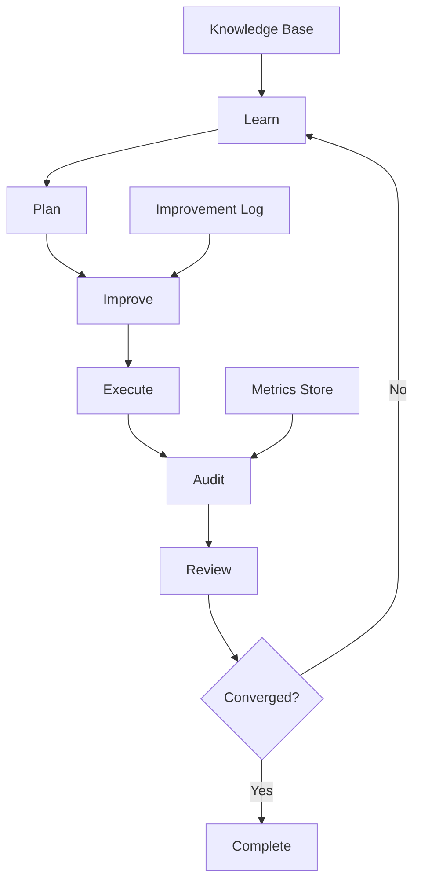

# Self-Improvement Loop Documentation

## Overview
The Grant Eval V3 Deep Research system implements a continuous self-improvement loop following the pattern:
**Learn → Plan → Improve → Execute → Audit → Review → Loop**

This creates a feedback-driven system that automatically improves its performance, accuracy, and efficiency over time.

## Loop Architecture



## Phase Details

### 1. LEARN Phase
**Purpose**: Analyze past performance to extract insights and patterns

#### Inputs
- Previous execution logs
- Performance metrics
- Error reports
- Success patterns
- User feedback

#### Process
```python
def learn_phase():
    # 1. Collect historical data
    sessions = collect_recent_sessions(days=7)
    
    # 2. Analyze patterns
    patterns = {
        "successful": identify_success_patterns(sessions),
        "failures": identify_failure_patterns(sessions),
        "bottlenecks": identify_performance_bottlenecks(sessions)
    }
    
    # 3. Extract insights
    insights = {
        "prompt_effectiveness": analyze_prompt_performance(),
        "model_selection": analyze_model_choices(),
        "tool_usage": analyze_tool_effectiveness(),
        "error_patterns": categorize_errors()
    }
    
    # 4. Update knowledge base
    knowledge_base.update(patterns, insights)
    
    return LearningReport(patterns, insights)
```

#### Outputs
- Learning Report with identified patterns
- Updated knowledge base
- Improvement recommendations

### 2. PLAN Phase
**Purpose**: Create optimized execution plans based on learnings

#### Inputs
- Learning Report from Learn phase
- Current objectives
- Resource constraints
- Performance targets

#### Process
```python
def plan_phase(learning_report):
    # 1. Define objectives
    objectives = {
        "primary": "Complete grant evaluation analysis",
        "quality": "Achieve 90% accuracy",
        "performance": "Complete within 5 minutes",
        "cost": "Use < 50K tokens"
    }
    
    # 2. Select strategies based on learnings
    strategies = {
        "model": select_optimal_model(learning_report),
        "prompts": optimize_prompts(learning_report),
        "tools": configure_tools(learning_report),
        "parallelization": plan_parallel_execution()
    }
    
    # 3. Create execution plan
    plan = ExecutionPlan(
        objectives=objectives,
        strategies=strategies,
        checkpoints=define_checkpoints(),
        fallback_options=define_fallbacks()
    )
    
    return plan
```

#### Outputs
- Execution Plan with strategies
- Resource allocation
- Success criteria
- Fallback procedures

### 3. IMPROVE Phase
**Purpose**: Implement improvements before execution

#### Inputs
- Execution Plan
- Current system configuration
- Improvement backlog

#### Process
```python
def improve_phase(plan):
    improvements = []
    
    # 1. Optimize prompts
    if plan.requires_prompt_optimization:
        new_prompts = optimize_prompt_templates(plan.prompt_strategy)
        improvements.append(("prompts", new_prompts))
    
    # 2. Tune parameters
    if plan.requires_parameter_tuning:
        new_params = tune_system_parameters(plan.performance_targets)
        improvements.append(("parameters", new_params))
    
    # 3. Update tools configuration
    if plan.requires_tool_updates:
        tool_config = optimize_tool_configuration(plan.tool_strategy)
        improvements.append(("tools", tool_config))
    
    # 4. Apply improvements
    for category, improvement in improvements:
        apply_improvement(category, improvement)
        log_improvement(category, improvement)
    
    return ImprovementReport(improvements)
```

#### Outputs
- Applied improvements list
- Configuration changes
- Performance predictions

### 4. EXECUTE Phase
**Purpose**: Run the actual research with monitoring

#### Inputs
- Optimized configuration
- Research objectives
- Monitoring parameters

#### Process
```python
def execute_phase(config, objectives):
    with monitoring.track_execution() as tracker:
        # 1. Initialize research
        research = DeepResearchExecutor(config)
        
        # 2. Execute with checkpoints
        results = []
        for checkpoint in config.checkpoints:
            try:
                result = research.execute_checkpoint(checkpoint)
                results.append(result)
                tracker.record_checkpoint(checkpoint, result)
                
                # Early termination check
                if should_terminate_early(result):
                    break
                    
            except Exception as e:
                # Fallback handling
                result = handle_fallback(checkpoint, e)
                results.append(result)
        
        # 3. Aggregate results
        final_result = aggregate_results(results)
        tracker.record_completion(final_result)
        
    return ExecutionReport(final_result, tracker.metrics)
```

#### Outputs
- Research results
- Execution metrics
- Checkpoint data
- Error logs

### 5. AUDIT Phase
**Purpose**: Comprehensive tracking and compliance checking

#### Inputs
- Execution Report
- Audit criteria
- Compliance requirements

#### Process
```python
def audit_phase(execution_report):
    audit = AuditReport()
    
    # 1. Performance audit
    audit.performance = {
        "latency": measure_latency(execution_report),
        "throughput": measure_throughput(execution_report),
        "resource_usage": measure_resources(execution_report)
    }
    
    # 2. Quality audit
    audit.quality = {
        "accuracy": validate_accuracy(execution_report),
        "completeness": check_completeness(execution_report),
        "consistency": verify_consistency(execution_report)
    }
    
    # 3. Compliance audit
    audit.compliance = {
        "data_handling": check_data_compliance(),
        "api_usage": verify_api_compliance(),
        "cost_limits": check_cost_compliance()
    }
    
    # 4. Generate audit trail
    audit.trail = generate_audit_trail(execution_report)
    
    return audit
```

#### Outputs
- Audit Report
- Compliance status
- Performance metrics
- Quality scores

### 6. REVIEW Phase
**Purpose**: Evaluate results and decide on next iteration

#### Inputs
- Audit Report
- Success criteria
- Convergence thresholds

#### Process
```python
def review_phase(audit_report):
    review = ReviewReport()
    
    # 1. Evaluate against criteria
    review.criteria_met = evaluate_success_criteria(audit_report)
    
    # 2. Check convergence
    review.convergence = {
        "performance": check_performance_convergence(),
        "quality": check_quality_convergence(),
        "cost": check_cost_convergence()
    }
    
    # 3. Identify areas for improvement
    review.improvements_needed = identify_improvement_areas(audit_report)
    
    # 4. Make continuation decision
    if all(review.convergence.values()):
        review.decision = "COMPLETE"
        review.reason = "All convergence criteria met"
    elif review.iteration_count > MAX_ITERATIONS:
        review.decision = "STOP"
        review.reason = "Maximum iterations reached"
    else:
        review.decision = "CONTINUE"
        review.reason = f"Improvements needed in: {review.improvements_needed}"
    
    return review
```

#### Outputs
- Review Report
- Continuation decision
- Improvement priorities
- Convergence status

## Implementation Example

```python
class SelfImprovementLoop:
    def __init__(self, config):
        self.config = config
        self.iteration = 0
        self.history = []
        self.converged = False
        
    def run(self):
        """Execute the complete self-improvement loop"""
        while not self.converged and self.iteration < self.config.max_iterations:
            self.iteration += 1
            print(f"\n=== Iteration {self.iteration} ===")
            
            # Learn from history
            learning_report = self.learn()
            self.log_phase("LEARN", learning_report)
            
            # Plan next execution
            execution_plan = self.plan(learning_report)
            self.log_phase("PLAN", execution_plan)
            
            # Implement improvements
            improvement_report = self.improve(execution_plan)
            self.log_phase("IMPROVE", improvement_report)
            
            # Execute research
            execution_report = self.execute(execution_plan)
            self.log_phase("EXECUTE", execution_report)
            
            # Audit execution
            audit_report = self.audit(execution_report)
            self.log_phase("AUDIT", audit_report)
            
            # Review and decide
            review_report = self.review(audit_report)
            self.log_phase("REVIEW", review_report)
            
            # Check convergence
            if review_report.decision == "COMPLETE":
                self.converged = True
                print("✅ Loop converged successfully!")
            elif review_report.decision == "STOP":
                print("⚠️ Loop stopped (max iterations or error)")
                break
                
            # Store iteration data
            self.history.append({
                "iteration": self.iteration,
                "learning": learning_report,
                "plan": execution_plan,
                "improvement": improvement_report,
                "execution": execution_report,
                "audit": audit_report,
                "review": review_report
            })
            
        return self.generate_final_report()
```

## Convergence Criteria

The loop converges when all of the following are met:

### Performance Convergence
- Latency variance < 10% over last 3 iterations
- Token usage stabilized (< 5% variance)
- Cost per run within budget

### Quality Convergence
- Accuracy > 90% threshold
- Consistency score > 0.95
- No critical errors in last 2 iterations

### Improvement Convergence
- Improvement delta < 2% per iteration
- No new failure patterns discovered
- All critical issues resolved

## Monitoring & Observability

### Key Metrics to Track
1. **Iteration Metrics**
   - Time per iteration
   - Improvements per iteration
   - Convergence rate

2. **Performance Metrics**
   - API call efficiency
   - Token usage trends
   - Cost optimization

3. **Quality Metrics**
   - Accuracy improvements
   - Error reduction rate
   - Consistency scores

### Visualization
```python
def visualize_improvement_loop(history):
    """Create visualization of improvement over iterations"""
    
    # Extract metrics over time
    iterations = [h["iteration"] for h in history]
    accuracy = [h["audit"].quality["accuracy"] for h in history]
    latency = [h["audit"].performance["latency"] for h in history]
    cost = [h["audit"].compliance["cost"] for h in history]
    
    # Plot improvement curves
    fig, axes = plt.subplots(3, 1, figsize=(10, 8))
    
    axes[0].plot(iterations, accuracy, 'g-', label='Accuracy')
    axes[0].set_ylabel('Accuracy')
    axes[0].legend()
    
    axes[1].plot(iterations, latency, 'b-', label='Latency (s)')
    axes[1].set_ylabel('Latency')
    axes[1].legend()
    
    axes[2].plot(iterations, cost, 'r-', label='Cost ($)')
    axes[2].set_ylabel('Cost')
    axes[2].set_xlabel('Iteration')
    axes[2].legend()
    
    plt.suptitle('Self-Improvement Loop Progress')
    plt.tight_layout()
    return fig
```

## Best Practices

### 1. Start Simple
- Begin with basic metrics and simple improvements
- Gradually add complexity as the system matures
- Focus on one dimension at a time initially

### 2. Fail Fast
- Implement early termination for failing paths
- Use circuit breakers for repeated failures
- Have clear fallback strategies

### 3. Measure Everything
- Track all decisions and their outcomes
- Maintain detailed audit trails
- Use metrics to drive decisions

### 4. Incremental Improvements
- Prefer small, measurable improvements
- Avoid large, risky changes
- Test improvements in isolation first

### 5. Human in the Loop (Optional)
- Allow manual intervention points
- Provide override capabilities
- Request human validation for critical decisions

## Configuration Template

```yaml
self_improvement:
  max_iterations: 10
  convergence_thresholds:
    performance:
      latency_variance: 0.1
      token_variance: 0.05
    quality:
      min_accuracy: 0.9
      min_consistency: 0.95
    improvement:
      min_delta: 0.02
      
  learning:
    history_window_days: 7
    min_samples: 5
    pattern_threshold: 0.7
    
  planning:
    strategies:
      - prompt_optimization
      - model_selection
      - tool_configuration
      - parallel_execution
    
  improvement:
    max_changes_per_iteration: 3
    rollback_on_failure: true
    test_before_apply: true
    
  execution:
    checkpoint_interval: 60  # seconds
    max_execution_time: 300  # seconds
    early_termination: true
    
  audit:
    track_all_metrics: true
    compliance_checks: true
    generate_reports: true
    
  review:
    auto_approve_threshold: 0.95
    require_human_review: false
    export_results: true
```

## Troubleshooting

### Common Issues

1. **Loop Not Converging**
   - Check convergence criteria are realistic
   - Verify improvements are being applied
   - Look for oscillating patterns

2. **Performance Degradation**
   - Review recent improvements
   - Check for resource leaks
   - Verify API rate limits

3. **Quality Issues**
   - Validate training data quality
   - Check prompt templates
   - Review model selection logic

### Debug Mode
```python
# Enable debug mode for detailed logging
loop = SelfImprovementLoop(config)
loop.debug = True
loop.verbose_logging = True
loop.save_all_artifacts = True
loop.run()
```

## Conclusion

The self-improvement loop transforms the Grant Eval V3 Deep Research system from a static tool into a dynamic, continuously improving platform. By systematically learning from each execution, planning improvements, and validating results, the system achieves higher performance, better quality, and lower costs over time.

The key to success is maintaining discipline in the loop execution, measuring everything, and making data-driven decisions at each phase. With proper implementation and monitoring, the system will converge to optimal performance while maintaining high quality and compliance standards.